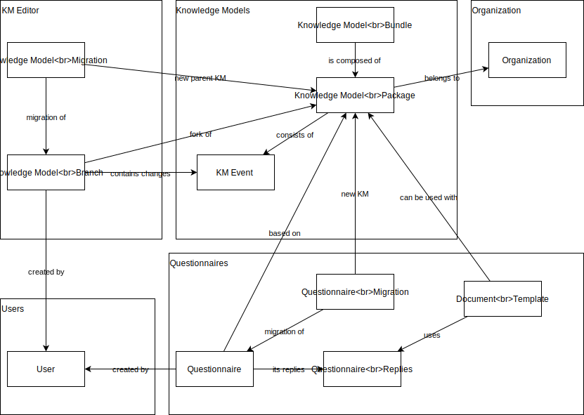
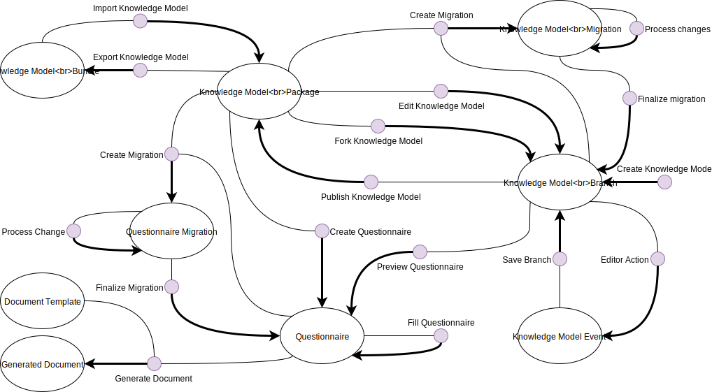

*********
About DSW
*********

What is DSW?
============

Data Stewardship Wizard is a joint `ELIXIR CZ <https://www.elixir-czech.cz>`_ and `ELIXIR NL <https://www.dtls.nl/elixir-nl/>`_ project bringing a simple but powerful solution for researchers to help them understand what is needed for good, FAIR-oriented Data Stewardship, to find ELIXIR experts to help out, and to build their own Data Management Plans. The DS Wizard can also function as a check list for data management professionals, like the checklists used by pilots before each flight.

.. image:: dsw_workflow.png
   :alt: DSW Workflow
   :align: center

FAIR
----

The main driver for the DSW is now to offer a convenient helpful tool for data stewards and researchers. Given a limited funding, we focus on this mission now. Howevever, from a long-term perspective, the richness of knowledge contained in the Wizard definitively calls for being FAIR. On this page we track the progress of compliance with the `FAIR principles <https://www.go-fair.org/fair-principles/>`_.

Machine-Actionable DMPs
-----------------------

We are part of the initiative `#activeDMPs <https://activedmps.org>`_. Here, we will post updates on concrete steps, mostly with the respect to the identified use cases. The work on this front will continue according to our available capacity and funding.

Terminology
===========

Concepts
--------

.. glossary::

  Organization
    An infrastructure, institution or a similar body that runs its own copy of DS Wizard. Identified by Organization ID.

  Knowledge Model (KM)
    An ordered collection of interlinked KM Items, from which a questionnaire is generated. Identified by a KM ID. May be customized and released as a package. Identified by a ID that consists of Organization ID, KM ID and Version. It can be exported/imported and further customized.

  Questionnaire
    A representation of a KM in a shape of a form for filling-in.

  Data Management Plan
    Exported filled questionnaire using selected template and format that should help researcher with data management in his/her project.

  KM Root
    A package with no ancestor packages.

  Customization of KM
    An ordered collection of changes of another parent knowledge model.

  KM Item
    A chapter, question, answer, reference, expert, integration, tag, etc.

  Change of KM Item
    Adding, editing, deleting of a knowledge item

  Migration of KM
    Upgrade of a KM with a newer version of the parent KM

Modules
-------

.. glossary::

  DS Wizard
    Our portal solution for Data Stewardship Planning. It contains :term:`Questionnaire`, :term:`KM Editor` and other parts for manamement of KMs and users.

  Questionnaire
    A tool for interactive browsing and answering a questionnare.

  KM Editor
    A tool for customization of a KM and its creation and publishing.

Types
=====

The following diagram shows individual types in DSW and how they are connected.

|dsw-types|

Operations
==========

The following diagram shows how the operations interact with the data
types in the DSW.

|dsw-operations|

Create Knowledge Model
----------------------

It creates a new Knowledge Model Branch that contains no Knowledge Model
Events.

Edit Knowledge Model
--------------------

It creates a branch for a Knowledge Model Package that is owned by the
organization of the current DSW instance. New versions can be published
as the next version of the original Knowledge Model Package.

Fork Knowledge Model
--------------------

It creates a branch for a Knowledge Model Package that is **not** owned
by the organization of the current DSW instance. New versions are
published as a new Knowledge Model Package.

Publish Knowledge Model
-----------------------

It creates a new version of the Knowledge Model Package from the new
events added to the Knowledge Model Branch.

Import Knowledge Model
----------------------

Knowledge Model Bundle file from outside of the DSW instance can be
imported. The Knowledge Model Packages contained in the bundle can be
then used in DSW.

Export Knowledge Model
----------------------

Knowledge Model Package can be exported out of the DSW instance in the
form of Knowledge Model Bundle file (with all its dependencies
included).

Editor Action
-------------

Using the Knowledge Model editor, Knowledge Model can be extended, and
events are generated.

Save Branch
-----------

Saving the branch simply saves all the events generated while using the
editor.

Create Knowledge Model Migration
--------------------------------

User can select a new parent Knowledge Model for a Knowledge Model
Branch that is outdated and create a Knowledge Model Migration.

Process Knowledge Model Migration Change
----------------------------------------

During the Knowledge Model migration, each change form the parent
Knowledge Model is reviewed and either applied or rejected to the
localization Knowledge Model.

Finalize Knowledge Model Migration
----------------------------------

After all the changes are applied or rejected, the migration can be
finalized, and the new version of the Knowledge Model Package can be
published.

Preview Questionnaire
---------------------

Users can preview a Questionnaire while working in Knowledge Model
Editor on a Knowledge Model Branch so that they can be sure with the
result before publishing the version.

Create Questionnaire
--------------------

A Questionnaire can be created from a specific version of a Knowledge
Model Package.

Fill Questionnaire
------------------

User can fill the answer in the Questionnaire and save them. These are
saved in the form of Questionnaire Replies.

Create Questionnaire Migration
------------------------------

Questionnaire Migration is created by choosing a new version of the
Knowledge Model Package for a Questionnaire.

Process Questionnaire Migration Change
--------------------------------------

Users go through each change affecting their answers in the
Questionnaire.

Finalize Questionnaire Migration
--------------------------------

Once all the changes are resolved, the migration can be finalized, and a
new Questionnaire is created.

Generate Document
-----------------

A Document output can be generated for each Questionnaire using a
Document Template.

Learn More
==========

- `DS Wizard (landing page) <https://ds-wizard.org>`_
- `Leaflet <https://github.com/ds-wizard/dsw-leaflet>`_
- `Diagrams <https://github.com/ds-wizard/dsw-diagrams>`_
- ELIXIR All Hands 2018

  - `Poster 2018 <https://github.com/DataStewardshipWizard/dsw-common/raw/master/wiki-resources/DSW_AllHands18_Poster_v4.pdf>`_
  - `Flask Talk <https://github.com/DataStewardshipWizard/dsw-common/raw/master/wiki-resources/DSW_AllHands18_FlashTalk.pdf>`_

- ELIXIR All Hands 2019

  - `Poster 2019 <https://f1000research.com/posters/8-1086>`_
  - `Workshop slides <https://f1000research.com/slides/8-1003>`_
